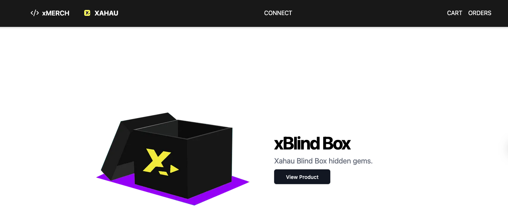

# XMerch Testing & Feedback Repository 🚀

Welcome to the **XMerch Testing & Feedback Repository**! 🎉 This space is dedicated to tracking **issues, feedback, and improvements** for XMerch, our decentralized e-commerce platform leveraging **Xahau/XRPL** payments. Your insights will help shape the future of seamless XAH commerce! 💡

## 📌 What is XMerch?
XMerch is an e-commerce platform built to demonstrate how businesses can **easily accept payments on Xahau/XRPL** without the complexity of traditional financial systems. This repository is where **testers, developers, and users** can report bugs, suggest improvements, and share their experiences.

## 🔥 How You Can Help
We appreciate your participation in testing **XMerch**! Here’s how you can contribute:

✅ **Report Bugs** – If you encounter issues while using XMerch, please open an issue with steps to reproduce it.

✅ **Suggest Features** – Have an idea that could improve the platform? Let us know!

✅ **Share Your Experience** – Tell us how your experience was and where we can improve usability.

✅ **Test Payment Flows** – Place test orders and provide feedback on the **checkout process, transaction handling, and overall experience.**

✅ **Validate the 50% Raffle Vault** – Participate in the **Feb 1 - 13 live testing phase**, where 50% of each purchase goes to a vault, and a **random wallet** will be rewarded!

## 🚀 How to Submit Feedback

1. **Check for Existing Issues** – Before submitting a new issue, browse the [Issues tab](https://github.com/mworks-proj/xmerch-testing/issues) to see if it has already been reported.
2. **Open a New Issue** – Click on the **New Issue** button and provide:
   - A **clear description** of the issue or feedback
   - Steps to reproduce (if applicable)
   - Screenshots or transaction IDs (if relevant)
3. **Discuss & Engage** – We actively monitor and respond to issues and suggestions!

## 🛠️ Testing Guidelines
- **Live Store URL:** [https://merch-25.vercel.app/](https://merch-25.vercel.app/)
- **Accepted Payment:** **$XAH on Xahau Mainnet**
- **Test Orders:** Buy an item (**1 $XAH + 0.03 shipping**) to experience the transaction flow.
- **Raffle Vault Testing:** Each purchase sends **50% to the vault** – the raffle ends **Feb 13**.

## 📌 Important Links
- **XMerch Live Store:** [https://merch-25.vercel.app/](https://merch-25.vercel.app/)
- **Submit an Issue:** [GitHub Issues](https://github.com/mworks-proj/xmerch-testing/issues)
- **Follow Xahau Network Updates:** [@XahauNetwork](https://twitter.com/XahauNetwork)

---

🙌 Thank you for being part of **XMerch’s development!** Your feedback is invaluable in making Web3 commerce accessible, efficient, and truly decentralized. Let’s build together! 🚀🔥

#BuildOnXahau #XMerch #Web3Commerce #XRPL #Xahau #Feedback #OpenSource

